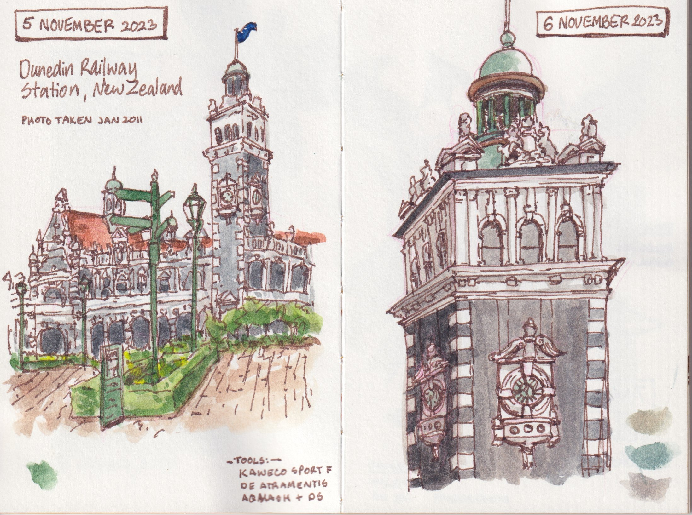
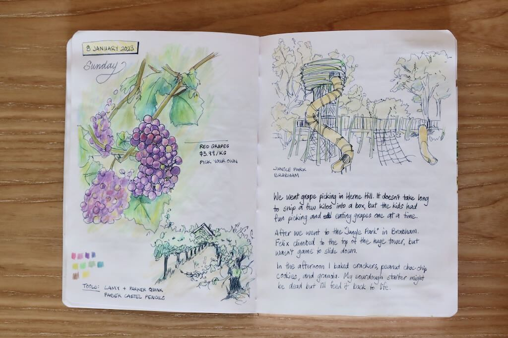
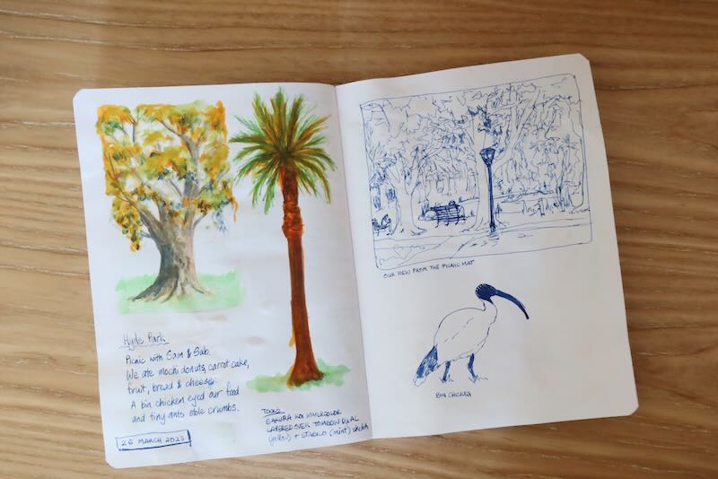
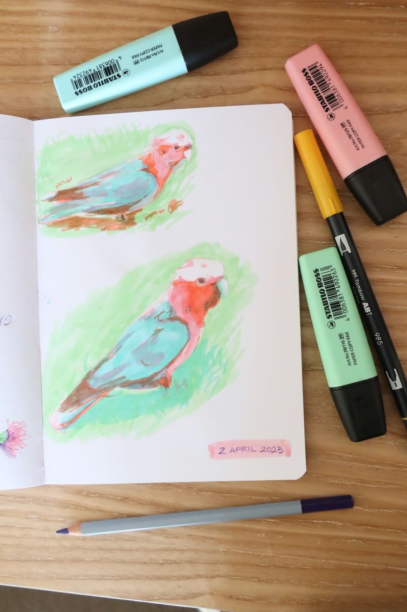
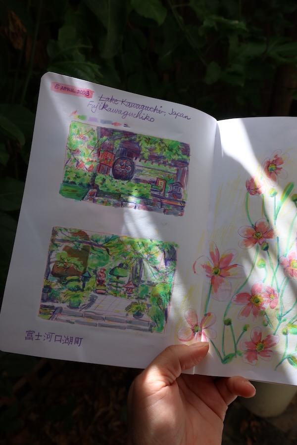
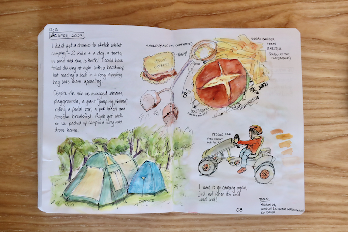
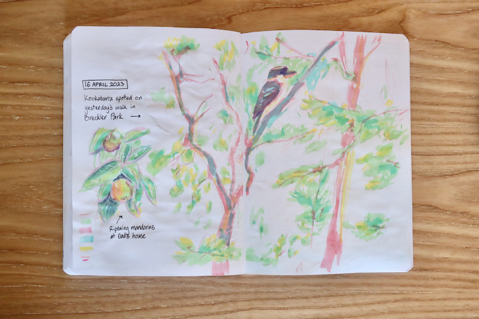
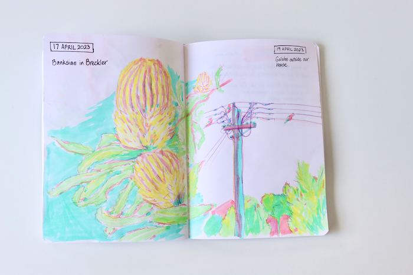

I've tried various times in the past to keep a journal, and usually it fizzles out very quickly. Bullet Journalling was more my speed for some time, but it was mainly to-do lists interspersed with a few notes for ideas. These days I have less free time to need organising, so that style of journal isn't so relevant for me.

For this sketchbook, I'm trying a looser and more visual approach. At the start of the year I bought myself an inexpensive, plain page notebook and refilled my old foutain pen. I'm not forcing myself to draw or write in it every day, although most days I do. Sometimes they're simple ink sketches, others I've tried to experiment with watercolour paint (not the best choice for this paper unfortunately). Sometimes it's about my day or referencing photos I've taken, other times it's whatever I feel like drawing. There are some ideas and notes, but no to-do lists. It's not neat, or cohesive, or well thought out. There is no pressure to be consistent or maintain a high standard, as I try to [[Optimise for curiosity, not productivity|Optimise for curiosity, not productivity]] It's just fun and exploratory.

I [completed this sketchbook](letters/letters6.md) at the end of June 2023, a huge achievement for me!

Here is a [super fast flip through](https://www.instagram.com/p/CvFOqgLMdL6/), and below are some of my favourite pages.
I [completed this sketchbook](letters/letters6.md) at the end of June 2023, a huge achievement for me!

This sketchbook was intentionally very experimental, varied and casual - sketchbook 2 has watercolour paper and is turning out a bit different!